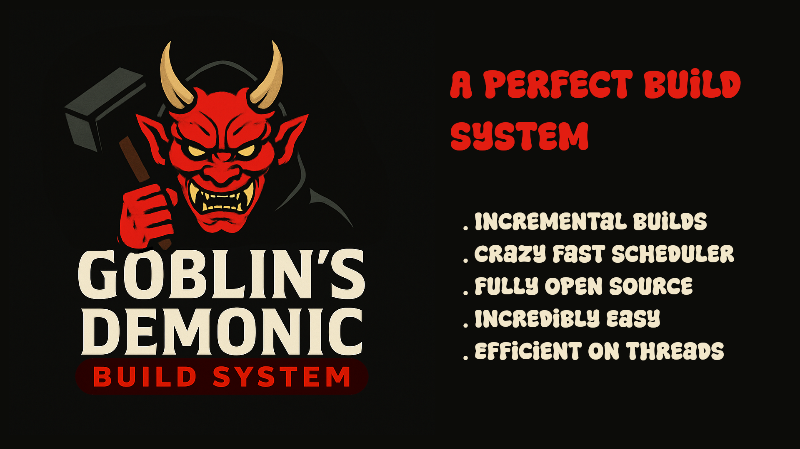

# Goblin's Demonic Build System 🗿
An open source build system for C/C++ projects with powerful dynamic threaded executer, Making it capable to build almost anything insanely fast. Unlike traditional build systems, Everything is powered by a simple configuration Language , written entirely in C++ with STL Only, Giving it enormus speed advantage and flexiblity.



## Installation
Installing `GDBS` is really straightforward, Just follow these commands.

### For First Time
```bash
git clone https://github.com/darkyboys/gdbs
cd gdbs
chmod +x build.sh
./build.sh
sudo mv gdbs /usr/local/bin
```

### For Those Who Already Have GDBS
```bash
git clone https://github.com/darkyboys/gdbs
cd gdbs
sudo gdbs . -make -install
```

## How To Use
`GDBS` Comes in 2 parts. `CLI` and `Core`.
The `CLI` is used by the programmer to access the `GDBS` without writing any C++ program manually. `Core` is used by the programmer to access the `GDBS` via programming.

### CLI
`CLI` stands for **Command Line Interface**, Something which you can use to talk to the `Core` without writing any C++. Understanding the `CLI` is crucial because a lot of the time you won't be talking to the `Core` directly.

Everything in `CLI` is a flag used to tell `GDBS` what to check. 
#### Flags
 - *--version / -v* : These flags will show you the `GDBS` current version you have.
 - *--thread / -t [number]* : These flags are used to tell the `GDBS` about how many cores of the cpu do you want to use for the compilation, By default `GDBS` will always use all the cores of your system for the best performance.
 - *--show-commands / -sc* : These flags tell the `GDBS` to not only log about what file is currently being built but also show the commands being used to compile that file.
 - *--clean / -c* : These flags tells the `GDBS` to rebuild the entire cache and rebuild your entire project from exact zero.
 - *--noincrement / -ni* : These flags tells the `GDBS` to skip the incremental build and build your entire project no matter what while keeping all the previous configs safe.
 
**Usage**
```bash
 > gdbs some flags
 > gdbs --clean
```

**Other Flags**
Aside the standard flags `GDBS` also have some other flags, These are used to provide `GDBS` the path to the `build.gdbs` or are specified inside the `build.gdbs`.

Anything starting without a `-` symbol will be taken as the path to `build.gdbs` so be careful while typing flags.

---

#### Build File
`GDBS` can only know what to do if you pass a `build.gdbs` file to it with the rules specified for what to build. Those rules will then be used to determine what to do.

Before you learn about any rules you need to know the basics of the (https://github.com/darkyboys/hell6.99mo)[H699] Basics. If you don't know then you can always visit here (https://github.com/darkyboys/hell6.99mo)[H699]. Although this guide will cover very basics of H699 Cofig Format (The format you will be writing the `build.gdbs` in) it's still worth checking the official guide.

#### Basics of H699
`H699` is a fast and Open Source configuration format designed for C++ projects, The reason it was chosen as the DSL of `GDBS` was because not only it is super fast to execute but also it have a really forgiving nature for the configs, Essentially making the programmer happy all the day about getting less possible errors, Also it's super easy to read and write by humans and can be also modified by programs. So with that's all let's dive deep into the syntax.


##### Scopes
`Scopes` in `H699` are used to define the entry for a configuration, They can hold any amount of properties also other scopes. 

*Example of a scope*
```config
scope:
    property
    property2
    property3
    anotherScope:
        anotherProperty
```

Now scope holds all the properties alongside with the `anotherScope` and `anotherScope` holds it's own properties while being inside the `scope`. They can be accessed via `scope.property` in programming but you don't have to worry about all of that because that part is handled by the `Core` not you.

##### Properties
`Properties` are essentially just the key/value pairs for holding values for the `GDBS Core` to understand and execute, For `GDBS` You only need to know 2 datatypes of the properties. `String` and `Arrays`.

**Strings**: They are written unside `""`(Double Quotes) and are used to hold some text information.
**Arrays**: They are the collection of strings seperated by a `,` inside `[]`.

*Example of properties*:
```config
property = "Some string value"
anotherProperty = ["some", "array", "value"]
```

> **Note** : This guide only covers what is needed for `GDBS`, It's still worth checking the [official documentation](https://github.com/darkyboys/hell6.99mo) for the project `H699`.

--- 

#### Important Part About GDBS
Everything we need to do is done inside the `build.gdbs` file with some scopes and properties. There are some standard scopes and some standard properties and rest except them are just used to describe the source files.

---

#### Writing build.gdbs
While writing `build.gdbs` we have to tell the `GDBS` about what file to compile and for that we opens a scope with the path to that file and fills it with some properties so that the `GDBS` can know what to do exactly.

*Example*
```bash
myfile.cpp:
    out = "Hello world.bin"
```

*Here we described that there is a file named `main.cpp` which we want to compile as `Hello world.bin"*

There are some standard scopes which we can not describe as a file and we will soon talk about them but as of now let's talk about the standard properties we can use to describe something.

##### Standard Properties
These are the implemented `Standard Properties` inside the `GDBS Core` which tells exactly what to do with a C++ source file.

##### Types of Known properties
These are in 2 types:
- Static
- Dynamic

**Static** propertys are those who only accepts a single type eg string.
**Dynamic** propertys are those who supports more than one types. eg a property can store both string and array.

*Let's start learning these propertys and write our first recipe*

##### out - Static string property
`out` is a property which tells the GDBS the name of your executable, This is optional as if you don't pass it the GDBS is intellegent enough to fetch the name from your source file's name without `.any extension`.

##### bin - Static string property
`bin` is a property which tells the GDBS the name of the directory where all the compiled binaries will be stored , Default is `bin`.

##### compiler - Static string property
`compiler` is a property which tells the GDBS the compiler you want to use to compile all your source files , Default is `g++`.

##### compiler_arguments - Static string property
`compiler_arguments` is a property which tells the GDBS the arguments you want to give to your compiler , Default is empty.

##### compiler_parguments - Static string property
`compiler_parguments` stands for the `compiler_primary_arguments` which is a property giving arguments to your compiler before the file name so if you want to make let say object files then say `compiler_parguments = "-c"`.

**Dynamic Array Type** These types supports _rem and _add as suffix to remove anything or add anything to them respectively.

##### system - Static string property
`system` is a property which tells the GDBS the command you want to execute when a target is built , This won't run if the target is skipped in incremental builds , Default is empty.

##### psystem - Static string property
`psystem` is a property which tells the GDBS the command you want to execute when a target is built , This won't run if the target is skipped in incremental builds , The only difference in between this and system is that this runs before the compiler and system runs after the compiler which is why it stands for primary system, Default is empty.

##### pkg_in - Dynamic String / Array Property
`pkg_in` is a property which tells the GDBS to look for pkg-config packages in your system if the packages aren't found the GDBS will throw error for package not found and hault the compilation. If you want a single package use string othervise for multiple packages feel free to use array.

##### include - Dynamic String / Array Property
`include` is a property which tells the GDBS to mark include directories for the compiler via `-I` flag. This also allows single string and arrays of strings.

##### lib - Dynamic String / Array Property
`lib` is a property which tells the GDBS to mark libraries for the compiler via `-l` flag. This also allows single string and arrays of strings.

##### combine - Dynamic String / Array Property
`combine` is a property which tells the GDBS to combine multiple C++ source files together to form a single binary , Remember incremental build will only apply to main binary not on combines ones , This also allows single string and arrays of strings.

##### compare - Dynamic String / Array Property
`compare` is used to tell the GDBS that it needs to register a file inside it's cached data set made for the project , Means if that file changes then it will trigger all those files to be rebuilt which relies on that file. This is specially usefull for the `Single Header Libraries` like `stbi_image.h`, `cpp-httplib` or even the `H699`.

---

##### Standard Scopes
These scopes are used to do something really important with the build process and they are very limited because of their functionality.

##### global
The `global` scope can take any property of a C++ source file except for the `out` and make those property globally accessible means all the source file scopes will automatically inherit everything `global` have except for those which the programmer have overwritten for example you might want to keep using `gtk3` package for all your source files so you can specify that in the `pkg_in` property inside `global` scope and all the C++ source files will automatically inherit means you no longer have to write `pkg_in` for every C++ source file's scope, But if you don't want that package for some `cli` files then you can simply overwrite the `pkg_in` for that file.

**Example**:
```bash
global:
    pkg_in = "gtk+-3.0"

window.cpp: out = "window.bin"
editor.cpp: out = "editor.bin"
cli.cpp:
    out = "cli.bin"
    pkg_in = "" # Overwritten
```

##### call
`call` is a really important scope because it can only take 2 properties `command` and `commands` the `command` is the static string and `commands` is the static array of string. Those properties are used to add some system commands which will execute before any compilation happens.

*Example*
```bash
call:
    command = "echo \"starting the build...\""
    commands = [
        "ls",
        "echo \"Listed all the directories!\""
    ]
```

*Here all those commands will execute before any compilation happens. Also you don't have to write both of them , You can just write one of them and you will be fine.

##### callback
`callback` is a really important scope because it works exactly like `call` even takes same arguments but only executes once the compilation is finished.

*Example*
```bash
call:
    command = "echo \"starting the build...\""
    commands = [
        "ls",
        "echo \"Listed all the directories!\""
    ]

callback:
`   command = "echo \"compilation finished.\""
```

##### onchange
`onchange` is another important scope because it also takes same properties as `call` and `callback` but will only execute those commands if anything is changed and after the compilation is finished.


*Example*
```bash
onchange:
    command = "echo \"Something did compile.\""
```

##### ontriggerchange
`ontriggerchange` is a subtle one but it works same as `onchange` but executes the commands before the compilation starts.

*Example*
```bash
ontriggerchange:
    command = "echo \"Something is about to be compiled.\""
```

##### cli
This is one of the most important additions to the `GDBS`, Because this directly allows the programers to take the input fromt the `CLI` and execute some commands for those inputs. This one can take any property as the argument and a dynamic `string/array` value as the commands to execute.

*Example*
```bash
cli:
    -install : "cp myapp /usr/local/bin
    -make    : [
        "echo \"Now the directory looks like\"",
        "ls"
    ]
```

*Here if the `GDBS CLI` gets any of those arguments `-install` or `-make` it will trigger the commands respectively. In fact multiple arguments can be given at once but remember that arguments from the `CLI` will put the `GDBS` into the `CLI Mode` means it will only execute those arguments (If given) and will not build anything. If only standard arguments were passed then it will build the project normally.*


--- 

### Real Life Example Of A build.gdbs
One of the best real life example of a `build.gdbs` can be 
```bash
main.cpp:
```
*Yes that's it. It will compile the `main.cpp` file with the `g++` compiled and already include the `include` directory by default.*

Another really good example can be the `build.gdbs` of the project `GDBS` itself. Yes the build system can build itself. And the official build file for the `GDBS` isn't a single file. It's splitted accross directories for crystal clear maintainance.

`build.gdbs`
```bash
# This is the official build file for the gdbs build system
cli:
    -mkcore = "gdbs build/core"
    -mkwrapper = "gdbs build/wrapper"
    -install = "mv bin/* /usr/local/bin"
    -make = [
        "gdbs . -mkcore",
        "gdbs . -mkwrapper"
    ]
```

`build/core/build.gdbs`
```bash
# This is the official build file for the gdbs build system's core
# This must be run from the root of the repo
global:
    compiler_parguments = "-c"
    bin = "objects"
    include = [
        "include",
        "src"
    ]

src/implementations/core.cc: out = "core.o"
src/implementations/executer.cc: out = "exec.o"
src/implementations/fs-utils.cc: out = "fsut.o"
include/ConsolePrint/ConsolePrint.cc: out = "conp.o"
```

`build/wrapper/build.gdbs`
```bash
# This is the official build file for the gdbs build system's cli wrapper
# This must be run from the root of the repo
global:
    include = [
        "include",
        "src"
    ]

src/gdbs.cc: 
    out = "gdbs"
    combine = [
        "objects/core.o",
        "objects/exec.o",
        "objects/fsut.o",
        "objects/conp.o"
    ]
```

*Try to figure out why are those written like they are and you will also find the reason why you might also prefer `GDBS` for your C/C++ projects. 😃*

---

## Contributing ?
Checkout the [CONTRIBUTING.md](CONTRIBUTING.md).

## Found Issues ?
Checkout the [ISSUES.md](ISSUES.md)

## Again! Thanks for reading. Hope you have the nice day (TIME 8:52PM IST, 11/12/25)